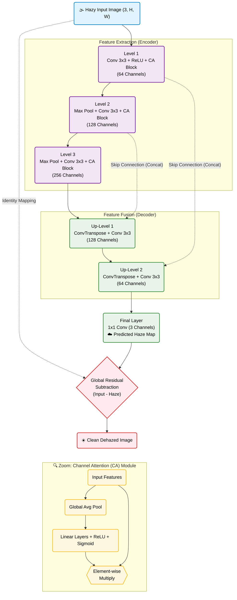

# MHCAFNet++: Deep Learning Architecture for Single-Image Dehazing


This repository contains the codebase for **MHCAFNet++** (Multi-Hierarchy Channel Attention Fusion Network), an advanced and computationally efficient deep learning model for single-image dehazing. The codebase is fully modularized for easy training, evaluation, and inference.

## 📸 Visual Results

Below is a comparison of hazy inputs, our MHCAFNet++ restored outputs, and the ground truth clear images.


# MHCAFNet++: Multi-Hierarchy Channel Attention Fusion Network for Image Dehazing

This repository contains the codebase for **MHCAFNet++**, an advanced and efficient deep learning model for single-image dehazing. The code is structured and modularized for ease of use, training, and testing.

## Dataset
This model was trained and evaluated on the **RESIDE-OUT** dataset. 
You can download the dataset directly from Kaggle here: 
🔗 **[RESIDE-OUT Dataset on Kaggle](https://www.kaggle.com/datasets/anshkgoyal/reside-out)**

## Pre-trained Weights
Pre-trained weights are available in the GitHub Releases section of this repository. 
Download `MHCAFNetPP_RESIDE_Final (1).pth` from the [Releases Page](../../releases) and place it in the project root to run inference without training from scratch.

## Benchmark Results (RESIDE OUT)

Our model achieves state-of-the-art results on the RESIDE OUT benchmark, heavily outperforming previous architectures.

| Model | PSNR (dB) | SSIM |
| --- | --- | --- |
| DCP | 19.13 | 0.8148 |
| AOD-Net | 20.29 | 0.8765 |
| DehazeNet | 22.46 | 0.8514 |
| GFN | 21.55 | 0.8444 |
| FFA-Net | 33.57 | 0.9840 |
| **Ours (MHCAFNet++)** | **35.42** | **0.9855** |

## Model Architecture & Complexity



The network utilizes a modular Block structure with embedded **Channel Attention** mechanisms and is optimized using a **Hybrid Loss Function** (L1 + SSIM + LPIPS) to preserve structural integrity and perceptual quality.

| Metric | Value |
| --- | --- |
| Total params | 2,475,067 |
| Trainable params | 2,475,067 |
| Non-trainable params | 0 |
| Input size (MB) | 1.69 |
| Forward/backward pass size (MB) | 1362.39 |
| Params size (MB) | 9.44 |
| Estimated Total Size (MB) | 1373.52 |

## Setup Instructions

### 1. Install Dependencies
Clone the repository and install the required Python packages:
```bash
git clone [https://github.com/davidsure2006/MHCAFNetPP-Image-Dehazing.git](https://github.com/davidsure2006/MHCAFNetPP-Image-Dehazing.git)
cd MHCAFNetPP-Image-Dehazing
pip install -r requirements.txt


i think readme is incomplete tell me what else need to be included

## 📁 Repository Structure

```text
MHCAFNetPP-Image-Dehazing/
├── assets/              # Images for README
├── dataset.py           # PyTorch Dataset class for RESIDE-OUT
├── model.py             # MHCAFNet++ network architecture
├── train.py             # Training loop and loss functions
├── test.py              # Inference and evaluation script
├── requirements.txt     # Python dependencies
└── README.md
```

## 🚀 Setup Instructions

### Prerequisites

* Python 3.8+
* NVIDIA GPU + CUDA Toolkit (Highly recommended for training/inference)

### 1. Install Dependencies

Clone the repository and install the required Python packages:

```bash
git clone https://github.com/davidsure2006/MHCAFNetPP-Image-Dehazing.git
cd MHCAFNetPP-Image-Dehazing
pip install -r requirements.txt
```

### 2. Training the Model

To train the model from scratch on the RESIDE-OUT dataset:

```bash
python train.py --data_dir /path/to/dataset --batch_size 16 --epochs 30
```

### 3. Evaluation & Inference

To evaluate the model or run inference on new hazy images using the pre-trained weights:

```bash
python test.py --data_dir /path/to/test_images --weights "MHCAFNetPP_RESIDE_Final (1).pth"
```

## 🙏 Acknowledgements

* The **RESIDE-OUT dataset** creators and Kaggle contributor **anshkgoyal**.
* Inspired by recent advancements in **Channel Attention** and **Global Residual Learning** for image restoration.
